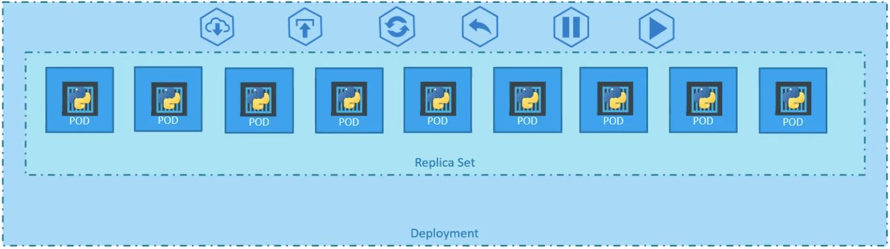
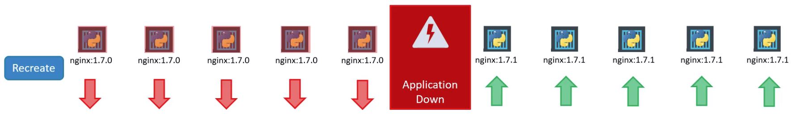
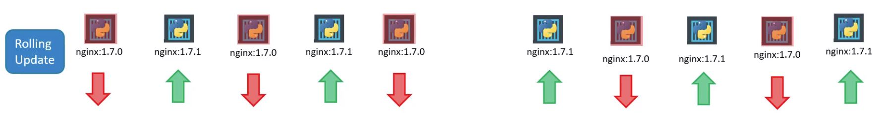

# Deployments

## Description
### ["A Deployment provides declarative updates for Pods and ReplicaSets."](https://kubernetes.io/docs/concepts/workloads/controllers/deployment/)

---
## Deployment Outline


---
## Sample Deployment Manifest.
```yaml
apiVersion: apps/v1
kind: Deployment
metadata:
  name: myapp-deploy
  labels:
    app: myapp
    tier: frontend
spec:
  replicas: 3
  selector:
    matchLabels:
      app: myapp
      tier: frontend
  template:
    metadata:
      name: nginx-pod
      labels:
        app: myapp
        tier: frontend
    spec:
      containers:
      - name: nginx
        image: nginx
```

---
## Cheat Sheet

| Command | Description |
|---|---|
| Deployment Help | |
| `kubectl explain deployment` | Display Deployment info |
| `kubectl create deployment` | Display Deployment help |
| Readonly Commands | |
| `kubectl get deployment` | List all Deployments |
| `kubectl get deployment <deploymentname>` | List single Deployment |
| `kubectl get deployment -o wide` | List detailed info about Deployment |
| `kubectl get deployment <deploymentname> -o wide` | List detailed info about a Deployment |
| `kubectl describe deployment <deploymentname>` | List full details about a Deployment |
| Create Manifest Command | |
| `kubectl ??? --dry-run=client -o yaml > deploy-myapp.yaml` | Generate a sample Deployment Manifest Definition file  |
| Apply Manifest | |
| `kubectl apply -f deploy-myapp.yaml` | Send the Manifest to Kubernetes API |
| `kubectl apply -f deploy-myapp.yaml --record` | As above - BUT now records the 'Change Cause' (log)|
| DELETE Deployment  | |
| `kubectl delete deployment <deploymentname>` | Deletes the Deployment (and all associated ReplicaSet(s) and Pod(s)) |

---
## Updates and Rollbacks
Rollout and Versioning
| Command | Description |
|---|---|
| Rollout Updates | |
| `kubectl rollout status deployment/<deploymentname>` | Display Deployment Rollout Status |
| `kubectl rollout history deployment/<deploymentname>` | Display Deployment Rollout History |
| `kubectl describe deployment <deploymentname>` | Shows 'Scaling' in the 'Events' section |
| `kubectl get replicaset <replicasetname>` | Shows all the 'old' (from previous deployment upgrades) ReplicaSets (with 0 or current number of Pods) |
| Rollout Rollbacks | |
| `kubectl rollout undo deployment/<deploymentname>` | Rollback to the previous Deployment |


---
## Deployment Strategy

---
### Recreate (incurs downtime)


---
### Rolling (zero downtime - BUT - the app has to support / handle this!)
